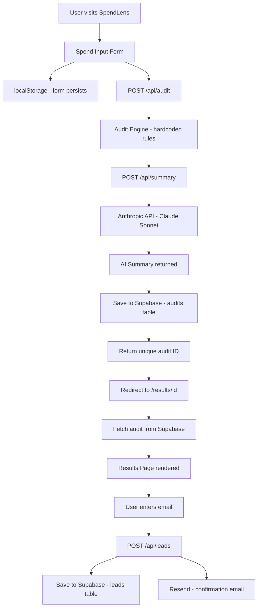

# Architecture

## System Diagram

## Data Flow

1. User fills the spend input form on the home page
2. Form data is saved to localStorage on every change
   so it persists across page reloads
3. On submit, form data is sent to POST /api/audit
4. The audit engine runs hardcoded rules against
   each tool and returns recommendations and savings
5. The audit route calls POST /api/summary which
   sends the recommendations to the Anthropic API
   and gets back a personalized 100-word summary
6. Everything is saved to Supabase as a single audit record
7. The unique audit ID is returned to the frontend
8. User is redirected to /results/[id]
9. The results page fetches the audit from Supabase
   and renders the full breakdown
10. User enters their email at the bottom
11. Email and audit ID are saved to the leads table
12. Resend sends a confirmation email to the user

## Stack

| Layer | Technology | Why |
|-------|-----------|-----|
| Frontend | Next.js 16 + TypeScript | Full-stack framework, great DX, easy Vercel deploy |
| Styling | Tailwind CSS | Utility-first, fast to build, consistent design |
| Database | Supabase (Postgres) | Free tier, instant setup, great TypeScript SDK |
| AI | Anthropic API (Claude Sonnet) | Best in class for text generation, reliable API |
| Email | Resend | Simple API, generous free tier, great deliverability |
| Deployment | Vercel | Zero config Next.js deploy, automatic from GitHub |
| Testing | Jest + ts-jest | Industry standard, works well with TypeScript |
| CI | GitHub Actions | Free, integrates with GitHub, runs on every push |

## Why Next.js over alternatives

- **vs React + Express:** Next.js gives us API routes built
in so we don't need a separate backend server. Simpler
deployment, less configuration.
- **vs Vue/Svelte:** Next.js has the best Vercel integration
and the largest ecosystem. For a 7-day build, ecosystem
size matters for finding solutions quickly.
- **vs Vanilla JS:** TypeScript + Next.js gives us type
safety which caught several bugs during development.
The assignment recommends TypeScript — it was the right call.

## Why hardcoded rules for the audit engine

The audit engine uses hardcoded if/else rules instead of AI.
This was deliberate. A finance person needs to read the
reasoning and agree with it. AI-generated audit logic would
be unpredictable and unverifiable. Hardcoded rules are:
- Transparent and auditable
- Consistent across all users
- Easy to update when pricing changes
- Faster and cheaper than an AI call

AI is used only for the summary paragraph where natural
language generation adds genuine value.

## What I would change for 10k audits per day

1. **Caching** — Cache audit results in Redis so repeated
   similar audits dont hit Supabase every time
2. **Queue** — Move the Anthropic API call to a background
   queue using Inngest or similar so the user gets results
   faster and API failures dont block the response
3. **Rate limiting** — Add proper rate limiting on the
   audit API route using Upstash Redis to prevent abuse
4. **CDN** — Move static assets to a CDN for faster
   global load times
5. **Database indexes** — Add indexes on audit_id and
   email columns in Supabase for faster lookups
6. **Monitoring** — Add Sentry for error tracking and
   Posthog for analytics to understand user behavior