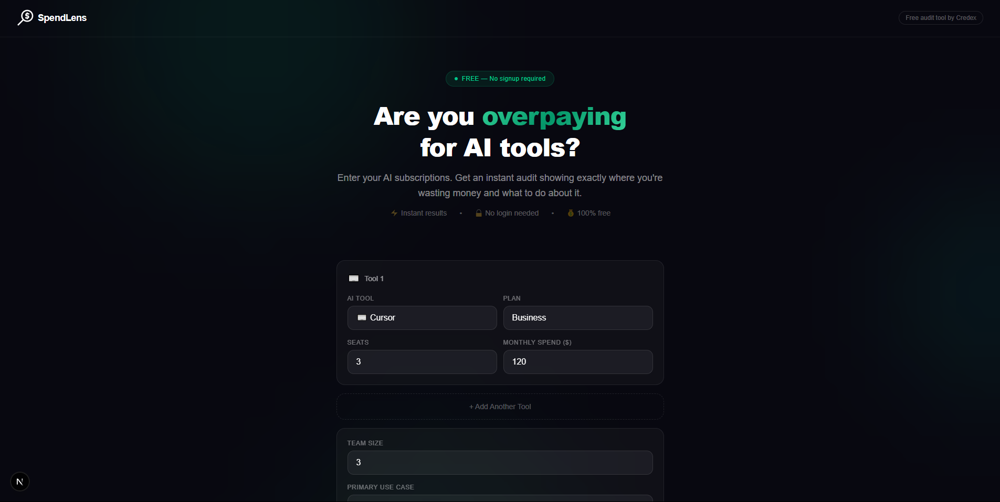
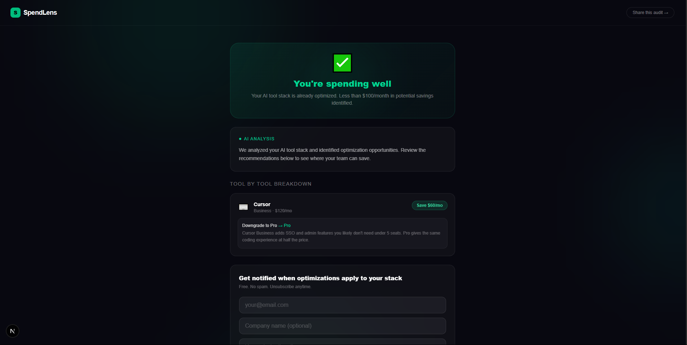
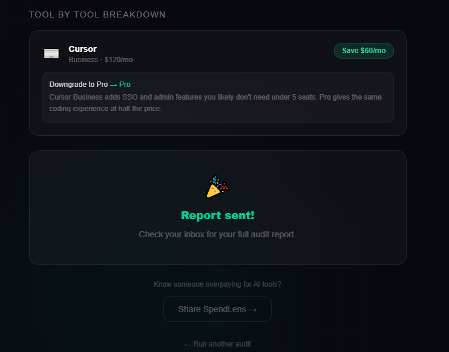

# SpendLens 🔍

> Find out if you're overpaying for AI tools.

SpendLens is a free web app that audits your AI tool
spending and tells you exactly where you're wasting
money and what to do about it. Built as a lead
generation tool for Credex — discounted AI infrastructure
credits.

## Screenshots






## Live Demo

https://spendlens-3h7a.vercel.app

## Who it's for

Engineering managers and CTOs at 5-25 person startups
paying $400-2000/month across multiple AI tools without
a clear picture of ROI. Also solo founders and indie
hackers wondering if they're being smart about their
AI subscriptions.

## Quick Start

### Run locally

```bash
git clone https://github.com/GeekyGotShrinkkked/spendlens
cd spendlens
npm install
cp .env.example .env.local
# Fill in your environment variables in .env.local
npm run dev
```

Open http://localhost:3000

### Environment variables

```env
NEXT_PUBLIC_SUPABASE_URL=your_supabase_url
NEXT_PUBLIC_SUPABASE_ANON_KEY=your_supabase_anon_key
ANTHROPIC_API_KEY=your_anthropic_api_key
RESEND_API_KEY=your_resend_api_key
NEXT_PUBLIC_APP_URL=http://localhost:3000
```

### Run tests

```bash
npm test
```

### Deploy

The app is configured for Vercel. Push to main and
Vercel deploys automatically. Add environment variables
in Vercel dashboard before deploying.

## Decisions

### 1. Hardcoded rules for audit engine instead of AI
The audit engine uses if/else rules, not AI. A finance
person needs to read the reasoning and agree with it.
AI-generated audit logic would be unpredictable and
unverifiable. Hardcoded rules are transparent, consistent,
and cheap. AI is used only for the summary paragraph
where natural language adds genuine value.

### 2. Next.js over separate frontend and backend
Next.js API routes eliminate the need for a separate
backend server. One codebase, one deployment, one repo.
For a 7-day build this massively reduces complexity
and deployment friction.

### 3. Supabase over Firebase
Supabase is Postgres under the hood — SQL is more
predictable than Firestore's document model for this
use case. The TypeScript SDK is excellent and the
free tier is generous enough for this project.

### 4. Email captured after value shown, never before
The assignment brief was explicit about this and it's
also just good product sense. Showing value first
then asking for email gets 3-5x better conversion
than gating the tool behind a signup form.

### 5. Resend over SendGrid for transactional email
Resend has a much simpler API, better developer
experience, and a generous free tier. For a 7-day
build, developer experience matters more than
enterprise features.

## Tech Stack

- **Frontend:** Next.js 16 + TypeScript
- **Styling:** Tailwind CSS
- **Database:** Supabase (Postgres)
- **AI:** Anthropic API (Claude Sonnet)
- **Email:** Resend
- **Deployment:** Vercel
- **Testing:** Jest + ts-jest
- **CI:** GitHub Actions

## Features

- Spend input form with localStorage persistence
- Audit engine with per-tool financial recommendations
- AI generated personalized summary via Anthropic API
- Lead capture with email confirmation via Resend
- Shareable unique URL per audit with Open Graph tags
- Deployed and working on Vercel